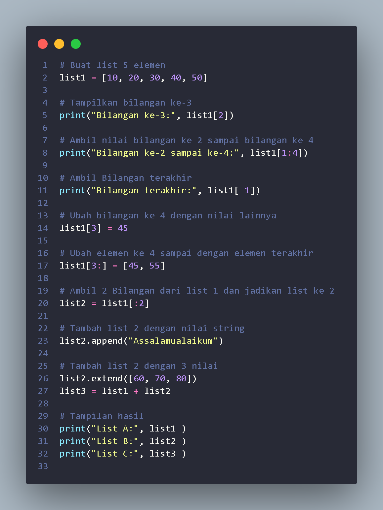
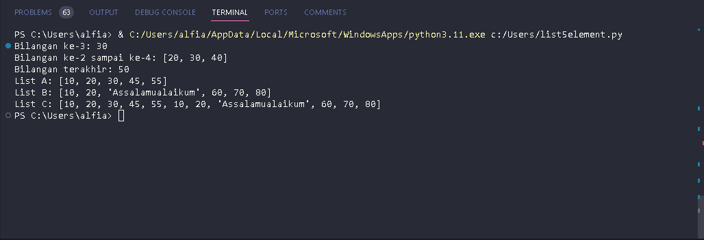
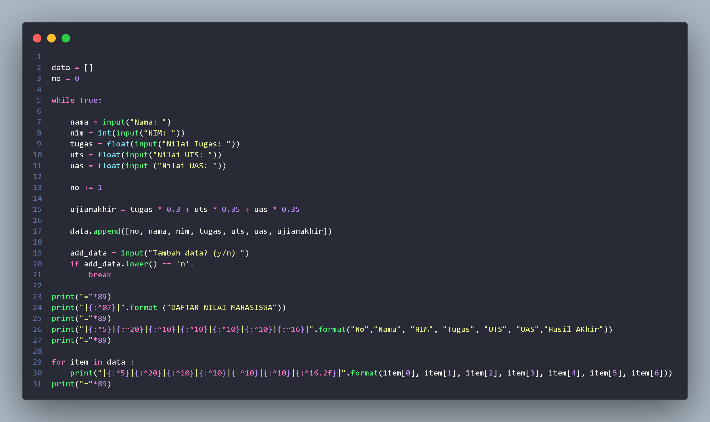
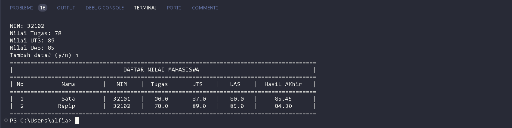

# Pertemuan 9

<h1>Latihan Praktikum</h1>

Buat sebuah list sebanyak 5 elemen dengan nilai bebas

+ 
akses list:

+ 
tampilkan elemen ke 3

+ 
 ambil nilai elemen ke 2 sampai elemen ke 4

+ 
 ambil elemen terakhir 

+ 
 ubah elemen list: 

+ 
ubah elemen ke 4 dengan nilai lainnya

+ 
ubah elemen ke 4 sampai dengan elemen terakhir

+ 
tambah elemen list:

+ 
ambil 2 bagian dari list pertama (A) dan jadikan list ke 2 (B)

+ 
tambah list B dengan nilai string

+ 
tambah list B dengan 3 nilai

+ 
gabungkan list B dengan list A

Tampilan Program List Bilangan

Hasil Output List Bilangan

<h1>Tugas Praktikum</h1>

Buat program sederhana untuk menambahkan data kedalam sebuah
list dengan rincian sebagai berikut:

+ 
Progam meminta memasukkan data sebanyak-banyaknya (gunakan
   perulangan)

+ 
Tampilkan pertanyaan untuk menambah data (y/t?), apabila jawaban
   t (Tidak), maka program akan menampilkan daftar datanya 

+ 
Nilai Akhir diambil dari perhitungan 3 komponen nilai (tugas: 30%
  uts: 35%, uas: 35%)

+ 
Buat flowchart dan penjelasan programnya pada README.md

Tampilan Program Menggunakan While

Output While

